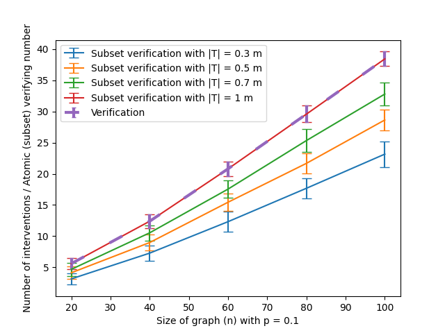

# Subset verification and search algorithms for causal DAGs

This is the accompanying repository of the "Subset verification and search algorithms for causal DAGs" paper. It is available at https://arxiv.org/abs/2301.03180. Our experiments are based on https://github.com/csquires/dct-policy, the accompanying repository of [SMG+20].

## Instructions on reproducing our experiments

To reproduce our figures in the appendix, execute `bash script.sh` after cloning. The script does the following:
1) Download necessary files
2) Modify the `dct-policy` codebase appropriately for our experiments
3) Run the experiments
4) Generate the plots and place in a folder called `figures`

We also included a copy of the produced `figures` sub-directory in here so you may look at the output without running the script.

## Implementation details

### Subset verification

We implemented our subset verification algorithm and tested its correctness on random trees and random Erdős-Rényi graphs with random subsets of target edges $T$.
On random trees, we know that the subset verification should be 1 since intervening on the root always suffices regardless of what $T$ is.
On random Erdős-Rényi graphs G\*, we chose $T$ to be a random subset of covered edges of G\* and checked that the subset verifying set is indeed a minimum vertex cover of $T$, whose size could be smaller than the full verification number $\nu$(G\*).

### Node-induced subset search

We modified the 1/2-clique separator subroutine of [GRE84] within the clique-separator based search algorithm of [CSB22] by only assigning non-zero weights to endpoints of target edges.

### Other full search algorithms that are benchmarked against

We modified them to take in target edges $T$ and terminate early once all edges in $T$ have been oriented.

## Synthetic graph generation

As justified by Section 3.1 in our paper, it suffices to study the performance of algorithms on connected DAGs without v-structures.
Our graphs are generated in the following way:
1. Fix the number of nodes $n$ and edge probability $p$
2. Generate a random tree on $n$ nodes
3. Generate a random Erdős-Rényi graph $G(n,p)$
4. Combine their edgesets and orient the edges in an acyclic fashion: orient $u \to v$ whenever vertex $u$ has a smaller vertex numbering than $v$.
5. Add arcs to remove v-structures: for every v-structure $u \to v \gets w$ in the graph, we add the arc $u \to w$ whenever vertex $u$ has a smaller vertex numbering than $w$.

## Experiment 1: Subset verification number for *randomly chosen target edges*

In this experiment, we study how the subset verification number scales when the target edges $T$ is chosen *randomly*.

For each pair of graph parameters $(n,p)$, we generate 100 synthetic DAGs.
Then, for each graph with $|E| = m$ edges, we sampled a random subset $T \subseteq E$ of sizes $\{0.3m, 0.5m, 0.7m, m\}$ and ran our subset verification algorithm.
Additionally, we run the verification algorithm of [CSB22] on the entire graph.
As expected, the verification number exactly matches the subset verification number in the special case where $|T| = m$.
Despite the trend suggested in the plots below, the number of target edges is typically \emph{not} a good indication for the number of interventions needed to be performed and one can always construct examples where $|T'| > |T|$ but $\nu(G,T') \not> \nu(G,T)$.
For example, for a subset $T \subseteq E$, we have $\nu$(G\*, $T'$) = $\nu$(G\*, $T$) if $T' \supset T$ is obtained by adding edges that are already oriented by orienting $T$.
Instead, the number of "independent target edges" (akin to "linearly independent vectors" in linear algebra) is a more appropriate measure.

**Above**: Plots for $p = \{0.001, 0.01, 0.03, 0.05, 0.1, 0.3\}$ across $n = \{10, 20, 30, \ldots, 100\}$. Observe that the subset verification number increases as the size of the random subset of target edges increases. Furthermore, in the special case of $|T| = m$, the subset verification number is exactly the verification number.

While the edge probability values may seem small, the graph is actually quite dense due to the addition of arcs to remove v-structures.
Below, we plot the number of edges of our generated graphs and compare it against the maximum number of possible edges.
Observe that the generated graph is almost a complete graph when $p = 0.3$.

**Above**: We plot the number of edges in our generated synthetic graphs and compare it against the maximum $\binom{n}{2}$ number of edges.
Observe that the generated graph is almost a complete graph when $p = 0.3$.

## Experiment 2: Local causal graph discovery

In this experiment, we compare node-induced subset search with full search algorithms on the task of local causal graph discovery where we only wish to orient edges around a target node of interest.
Following [CSB22], we base our evaluation on the experimental framework of [SMG+20] which empirically compares atomic intervention policies.

We compared the following atomic intervention algorithms against the atomic verification number $\nu_1$(G\*) and atomic subset verification number $\nu_1$(G\*, $T$):
- `random`: A baseline algorithm that repeatedly picks a random non-dominated node (a node that is incident to some unoriented edge) from the interventional essential graph
- `dct`: `DCT Policy` of [SMG+20]
- `coloring`: `Coloring` of [SKD+15]
- `separator`: Clique-separator based search algorithm of [CSB22]
- `SubsetSearch`: Our modification of `separator` that treats the union of endpoints of given target edges as the vertices in the node-induced subgraph of interest.
That is, we may end up increasing the set of target edges $T \subseteq E$ if the input $T$ was not already all edges within a node-induced subgraph.
However, note that the given inputs $T$ for this experiment already includes all edges within a node-induced subgraph so this is not a concern.

While our algorithms to construct the Hasse diagram and solve the produced interval stabbing problem is fast, we remark that the current implementation for computing R(G\*, v) for each $v \in V$ in the `causaldag` package (https://causaldag.readthedocs.io/en/latest/#) can be slow.
In particular, it is *not* the $\mathcal{O}(d \cdot |E|)$ time algorithm 2 of [WBL21] mentioned in Appendix A of our paper.
In our experiments, computing R(G\*, v) takes up more than 98\% of the running time for computing subset verification numbers for each graph G\*.
However, note that in practical use case scenarios, one simply use the algorithms without actually needing computing R(G\*, v), so this is not a usability concern.

**Above**: `SubsetSearch` consistently uses less interventions than existing state-of-the-art full graph search algorithms when we only wish to orient edges within a r-hop neighborhood of a randomly chosen target node $v$. Left: 1-hop; Right: 3-hop.

## References

[This paper] Davin Choo, and Kirankumar Shiragur. Subset verification and search algorithms for causal DAGs. 2022. Available at https://arxiv.org/abs/2301.03180

[CSB22] Davin Choo, Kirankumar Shiragur, and Arnab Bhattacharyya. Verification and search algorithms for causal DAGs. Advances in Neural Information Processing Systems, 2022. Available at https://arxiv.org/abs/2206.15374

[GRE84] John R. Gilbert, Donald J. Rose, and Anders Edenbrandt. A Separator Theorem for Chordal Graphs. SIAM Journal on Algebraic Discrete Methods, 1984. Available at: https://epubs.siam.org/doi/abs/10.1137/0605032

[SKD+15] Karthikeyan Shanmugam, Murat Kocaoglu, Alexandros G. Dimakis, and Sriram Vishwanath. Learning causal graphs with small interventions. Advances in Neural Information Processing Systems, 2015. Available at: https://arxiv.org/pdf/1511.00041.pdf

[SMG+20] Chandler Squires, Sara Magliacane, Kristjan Greenewald, Dmitriy Katz, Murat Kocaoglu, and Karthikeyan Shanmugam. Active Structure Learning of Causal DAGs via Directed Clique Trees. Advances in Neural Information Processing Systems, 2020. Available at: https://arxiv.org/pdf/2011.00641.pdf

[WBL21] Marcel Wienöbst, Max Bannach, and Maciej Liśkiewicz. Extendability of causal graphical models: Algorithms and computational complexity. Uncertainty in Artificial Intelligence, 2021. Available at: https://proceedings.mlr.press/v161/wienobst21a.html
